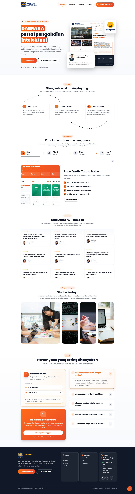
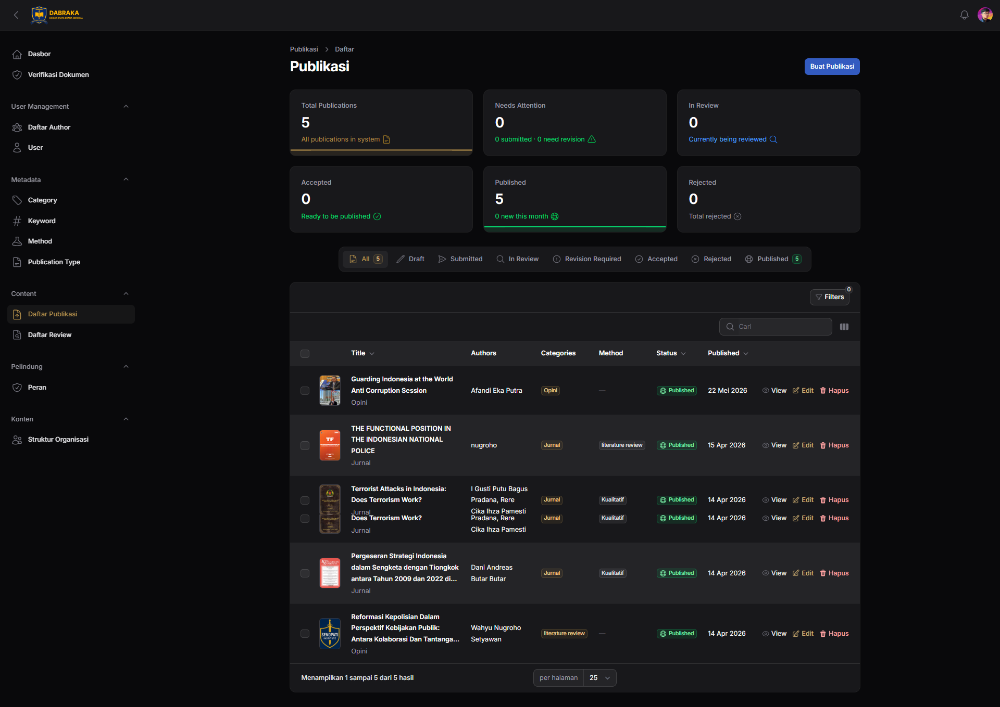
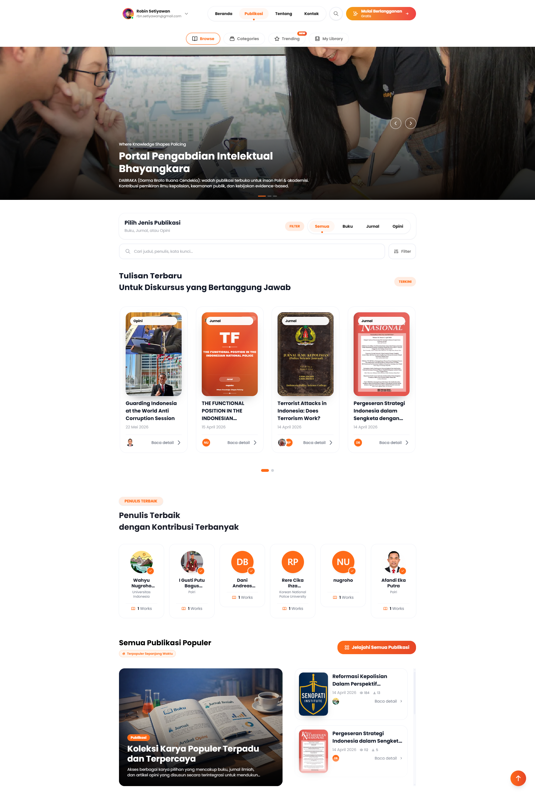
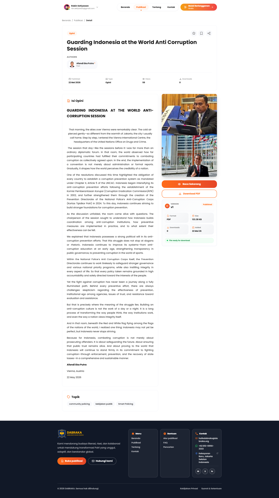
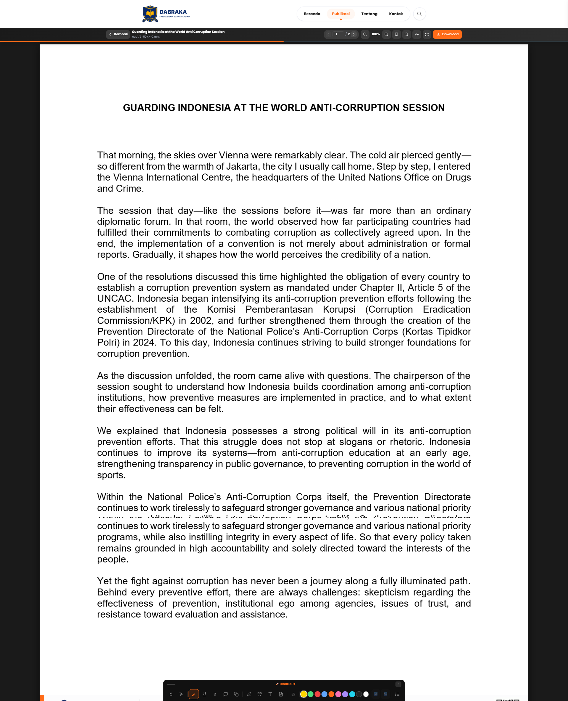

# DABRAKA

## Open Source for Knowledge-Driven Policing

DABRAKA is an open-source platform that supports intellectual contribution, research dissemination, strategic studies, and collaborative knowledge development for policing and public security communities.

### Where Knowledge Shapes Policing

DABRAKA (Darma Brata Buana Cendekia) is a collaborative intellectual contribution platform dedicated to advancing policing knowledge, public security studies, and evidence-based policy development in Indonesia.

The platform serves as a hub for members of the Bhayangkara community, academics, researchers, practitioners, and policy experts who share a commitment to strengthening policing institutions through knowledge, research, and intellectual collaboration.

DABRAKA was founded on the belief that institutional transformation is not driven solely by organizational structures and regulations, but also by the continuous development of ideas, literacy, critical thinking, and scholarly reflection.

By connecting field experience, academic research, strategic studies, and policy-oriented discourse, DABRAKA aims to cultivate a living knowledge ecosystem that supports adaptive, professional, and globally informed policing.

🌐 Production Platform: https://dabraka.org

---

## Vision

To become a globally recognized and collaborative intellectual contribution platform for advancing:

- Policing Science
- Public Security
- Evidence-Based Policy

In support of a professional, adaptive, and knowledge-driven transformation of the Indonesian National Police.

---

## Mission

- Collect and publish strategic ideas, insights, and scholarly contributions from members of the Indonesian National Police and civilian intellectuals.
- Promote literacy, research culture, and evidence-based scientific discourse.
- Foster national and international collaboration among law enforcement institutions, academics, researchers, and knowledge communities.
- Develop a progressive, inclusive, and globally relevant policing knowledge ecosystem.
- Provide a space for intellectual reflection and meaningful contributions to institutional transformation.

---

## Core Values

### Integrity

We uphold honesty, accountability, and transparency in every aspect of our work.

### Innovation

We continuously seek new ideas and approaches to address emerging challenges and opportunities.

### Collaboration

We believe meaningful progress is achieved through partnerships, shared knowledge, and collective expertise.

### Excellence

We are committed to maintaining the highest standards of quality, professionalism, and intellectual rigor.

---

## Real-World Impact

DABRAKA is actively deployed and used in a production environment to support knowledge dissemination, scholarly publications, strategic studies, and intellectual collaboration.

The platform continues to evolve through ongoing development, community engagement, and long-term maintenance, supporting the growing need for a modern, accessible, and collaborative policing knowledge ecosystem.

---

## Technology Stack

- Laravel 12
- Filament 4
- Livewire
- MySQL
- Docker
- Vite
- Tailwind CSS

## Screenshots

### Landing Page

The public-facing homepage introduces DABRAKA's mission, publication ecosystem, key features, publication workflow, testimonials, and frequently asked questions. It serves as the main entry point for authors, readers, researchers, and members of the policing knowledge community.



---

### Publication Dashboard

The publication management dashboard provides authors and administrators with a centralized workspace to manage publications, monitor publication status, review submissions, and track publication performance through a clean and modern interface.



---

### Publication Catalog

The publication catalog enables users to browse and discover books, journals, opinion articles, and other intellectual works. Advanced filtering, categorization, and author discovery features help users quickly find relevant content.



---

### Publication Detail Page

Each publication has a dedicated detail page displaying metadata, author information, publication statistics, downloadable resources, topic tags, and publication summaries before reading the full content.



---

### Publication Reader

The integrated reading interface provides a distraction-free reading experience with document viewing controls, zoom functionality, page navigation, and PDF download support for published works.



---

## Key Features Demonstrated

- Public publication portal
- Publication discovery and search
- Author profiles and contribution tracking
- Publication submission workflow
- Publication management dashboard
- PDF document reader
- Publication categorization and metadata management
- Downloadable publication resources
- Responsive modern user interface
- Knowledge-sharing ecosystem for policing and public security communities

## Key Features

### Knowledge Platform

- Public knowledge dissemination
- Strategic studies publication
- Academic content management

### Publication Management

- Submission workflow
- Editorial review process
- Publication lifecycle management

### Discovery & Access

- Full-text article reading
- Category-based navigation
- Search and filtering
- Digital library

### User Management

- Authentication
- Author profiles
- Profile management

### Community Engagement

- Testimonials
- Knowledge sharing
- Intellectual collaboration

### Future Expansion

- Learning platform
- Community ecosystem
- International collaboration

## Installation

## Requirements

Before installing DABRAKA, ensure your environment meets the following requirements:

PHP 8.3+
Composer 2+
Node.js 20+
MySQL 8+
Docker (optional)

### Clone Repository

```bash
git clone https://github.com/rbnset/dabraka.git
cd dabraka
```

### Install Dependencies

```bash
composer install
npm install
```

### Environment Configuration

Copy the example environment file:

```bash
cp .env.example .env
```

Generate the application key:

```bash
php artisan key:generate
```

### Configure Database

Update your `.env` file:

```env
DB_CONNECTION=mysql
DB_HOST=127.0.0.1
DB_PORT=3306
DB_DATABASE=dabraka
DB_USERNAME=root
DB_PASSWORD=
```

### Run Database Migrations

```bash
php artisan migrate
```

### Seed Initial Data

```bash
php artisan db:seed
```

Or run both together:

```bash
php artisan migrate --seed
```

### Build Frontend Assets

Development:

```bash
npm run dev
```

Production:

```bash
npm run build
```

### Create Administrator Account

```bash
php artisan make:filament-user
```

### Start Development Server

```bash
php artisan serve
```

Application will be available at:

```text
http://127.0.0.1:8000
```

---

## Docker Installation

If Docker is available:

```bash
docker compose up -d --build
```

Run migrations:

```bash
docker compose exec app php artisan migrate --seed
```

---

## Default Access

Create an administrator account using:

```bash
php artisan make:filament-user
```

Then access:

```text
/admin
```

---

## Project Structure

```text
app/
├── Filament/
├── Http/
├── Models/
├── Services/
├── Repositories/

database/
├── migrations/
├── seeders/

resources/
├── views/
├── js/
├── css/

routes/
├── web.php
├── console.php
```

---

## Contributing

Contributions are welcome.

1. Fork the repository
2. Create a feature branch

```bash
git checkout -b feature/my-feature
```

3. Commit changes

```bash
git commit -m "Add new feature"
```

4. Push branch

```bash
git push origin feature/my-feature
```

5. Open a Pull Request

---

## Security

If you discover a security vulnerability, please report it responsibly through the project maintainers before publicly disclosing the issue.

---

## Acknowledgements

DABRAKA is developed to support knowledge-driven policing, public security research, and collaborative intellectual contributions within Indonesia's policing and academic communities.

Special thanks to all contributors, researchers, practitioners, and members of the Bhayangkara community who continue to strengthen the ecosystem through knowledge sharing and scholarly collaboration.

## Roadmap

- [ ] AI-powered manuscript categorization
- [ ] Automated plagiarism detection integration
- [ ] Advanced reviewer recommendation system
- [ ] Journal analytics dashboard
- [ ] Multi-tenant journal support
- [ ] Publication metrics and impact tracking
- [ ] AI-assisted editorial workflow

## Production Usage

The platform currently supports publication management, intellectual contribution workflows, document dissemination, and collaborative knowledge sharing for policing and public security communities.

DABRAKA continues to receive ongoing development, feature enhancements, and long-term maintenance.

## Maintainer

Robin Setiyawan

Software Engineer focused on Laravel, Filament, AI-assisted development, and scalable web applications.

GitHub: https://github.com/rbnset
LinkedIn: https://linkedin.com/in/robin-setiyawan

## License

This project is licensed under the MIT License.

See the LICENSE file for more information.
